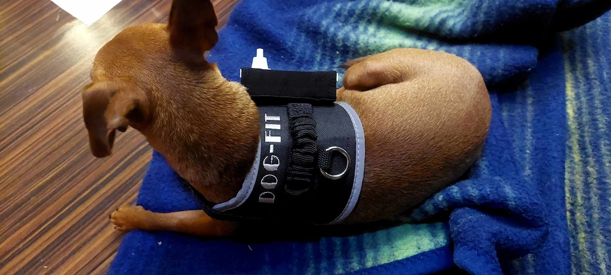

---
# 🧩 Versioning – systém dopĺňa automaticky
fm_version: "1.0.1"

# Dátum buildu – generuje skript
fm_build: "2026-10-03T07:50:26.018715+00:00"

# Poznámka k verzii – voliteľné
fm_version_comment: ""

# 🆔 IDENTITY --------------------------------------------------------

# ID generuje CLI / skript

# Unikátne UUID – generuje skript
guid: "988a086c-9e69-43dd-9456-cb91c7b64ade"

# 🧭 CONTEXT ---------------------------------------------------------

# DAO / doména (knife, sdlc, q12, 7ds...) dopĺňa skript
dao: "class_sthdf_dashboard"

# Názov zápisu – dopĺňa používateľ

# Krátky popis – dopĺňa používateľ (voliteľné)

# 👥 AUTHORSHIP ------------------------------------------------------

# Hlavný autor – z globálneho configu
author: "Roman Kazicka"

# Zoznam autorov – generuje skript
authors:
  - "Roman Kazicka"

# 🗂 CLASSIFICATION ---------------------------------------------------

# Nadradená kategória – môže doplniť používateľ
category: ""

# Typ dokumentu (guide, case, tutorial...) – používateľ (voliteľné)
type: ""

# Priorita (low/medium/high) – voliteľné
priority: ""

# Tagy – odporúča sa 2–6 tagov.
# Typy tagov:
#   - rámce: knife, 7ds, sdlc, q12
#   - účel: tutorial, guide, pattern, case-study
#   - téma: git, backup, ai, communication
#   - úroveň: beginner, intermediate, advanced

# 🌍 LOCALIZATION -----------------------------------------------------

# Jazyk dokumentu – doplní skript podľa štruktúry
locale: "sk"

# 🕒 LIFECYCLE --------------------------------------------------------

# Dátum vytvorenia – generuje skript
created: "2026-10-03 09:50"

# Dátum poslednej úpravy – dopĺňa človek
modified: "2026-10-03 09:50"

# Stav dokumentu – default "backlog"
status: "backlog"

# Viditeľnosť – default "public"
privacy: "public"

# ⚖ INTELLECTUAL PROPERTY -------------------------------------------

# Držiteľ práv k obsahu – dopĺňa skript
rights_holder_content: "Roman Kazicka"

# Systémový vlastník práv
rights_holder_system: "CAA / KNIFE / LetItGrow"

# Licencia
license: "CC-BY-NC-SA-4.0"

# Disclaimer
disclaimer: "Use at your own risk. Methods provided as-is; participation is voluntary and context-aware."

# Copyright
copyright: "© 2025 Roman Kazicka"

# 🔗 ORIGIN / PROVENANCE ---------------------------------------------

# Repozitár pôvodu
origin_repo: ""

# URL pôvodného repozitára
origin_repo_url: ""

# Commit pôvodu
origin_commit: ""

# Branch pôvodu
origin_branch: ""

# Systém pôvodu (CAA/KNIFE/STHDF…)
origin_system: "CAA"

# Pôvodný autor
origin_author: "Roman Kazicka"

# Importovaný zdroj
origin_imported_from: ""

# Dátum importu
origin_import_date: ""

# 🧱 RESERVED ---------------------------------------------------------

fm_reserved1: ""
fm_reserved2: ""
title: ✨ Showcase — Best of 2023
description: Curated highlights from student work and projects.
sidebar_label: Showcase
sidebar_position: 3
keywords: [showcase, highlights]
tags: [showcase]
knife:
  type: showcase
  owner_alias: TEACHING_TEAM
  version: 0.1
  status: draft
  related_prj: []
  kc_refs: []
---
<!-- class_sthdf_dashboard_INSTANCE_ID: 01-class_sthdf_dashboard_2023-2024 -->

[🏠 Domov](../../index.md) · [⬅️ Nahor](../index.md)

# Showcase — Best of 2023

Výber najlepších prác ročníka 2023-2024.

---

### CarCharm — Learning through play

*Lucia Rapánová, Sofia Shatokhina, Alica Urbanová · PRJ004 · ST037, ST039, ST043 · 2023–2024*

Autíčko mBot2 ovládané zvukmi zobcovej flauty: každý zo štyroch tónov (e5, g5, b5, d6) znamená jeden smer jazdy. Učenie hry na flautu sa mení na hru pre deti aj dospelých. Tóny rozpoznáva model natrénovaný v Teachable Machine.

[Read →](../../projects/PRJ004/index.md)

---

### Dog-Fit — zdravie psa pod kontrolou

*Emma Machacova · PRJ025 · 2023–2024*

Systém na monitorovanie zdravia psov v reálnom čase: snímač pulzu s modulom ESP8266 posiela tep a fyzickú aktivitu do platformy ThingSpeak, kde ich majiteľ sleduje a vyhodnocuje. Projekt je zdokumentovaný aj v Enterprise Architect (LemonTree, paralelné modelovanie, digitálny duplikát).

[Read →](../../projects/PRJ025/index.md)
