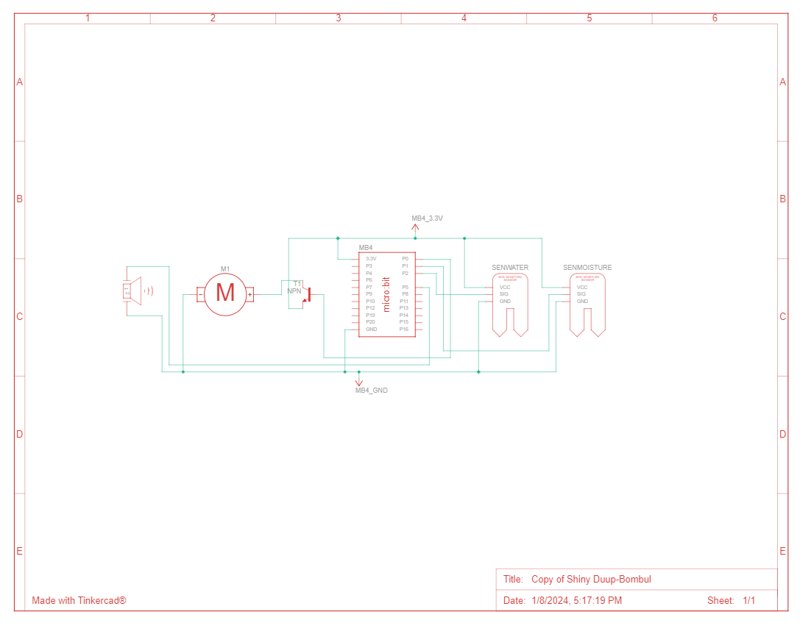

---
# 🧩 Versioning – systém dopĺňa automaticky
fm_version: "1.0.1"

# Dátum buildu – generuje skript
fm_build: "2026-10-03T07:50:26.195770+00:00"

# Poznámka k verzii – voliteľné
fm_version_comment: ""


# 🆔 IDENTITY --------------------------------------------------------

# ID generuje CLI / skript

# Unikátne UUID – generuje skript
guid: "2721845b-c803-47c0-9cbd-6f8f5a7c841c"


# 🧭 CONTEXT ---------------------------------------------------------

# DAO / doména (knife, sdlc, q12, 7ds...) dopĺňa skript
dao: "class_sthdf_dashboard"

# Názov zápisu – dopĺňa používateľ
title: "slides"

# Krátky popis – dopĺňa používateľ (voliteľné)
description: "{{DESCRIPTION}}"


# 👥 AUTHORSHIP ------------------------------------------------------

# Hlavný autor – z globálneho configu
author: "Roman Kazicka"

# Zoznam autorov – generuje skript
authors:
  - "Roman Kazicka"


# 🗂 CLASSIFICATION ---------------------------------------------------

# Nadradená kategória – môže doplniť používateľ
category: ""

# Typ dokumentu (guide, case, tutorial...) – používateľ (voliteľné)
type: ""

# Priorita (low/medium/high) – voliteľné
priority: ""

# Tagy – odporúča sa 2–6 tagov.
# Typy tagov:
#   - rámce: knife, 7ds, sdlc, q12
#   - účel: tutorial, guide, pattern, case-study
#   - téma: git, backup, ai, communication
#   - úroveň: beginner, intermediate, advanced
tags: []


# 🌍 LOCALIZATION -----------------------------------------------------

# Jazyk dokumentu – doplní skript podľa štruktúry
locale: "sk"


# 🕒 LIFECYCLE --------------------------------------------------------

# Dátum vytvorenia – generuje skript
created: "2026-10-03 09:50"

# Dátum poslednej úpravy – dopĺňa človek
modified: "2026-10-03 09:50"

# Stav dokumentu – default "backlog"
status: "backlog"

# Viditeľnosť – default "public"
privacy: "public"


# ⚖ INTELLECTUAL PROPERTY -------------------------------------------

# Držiteľ práv k obsahu – dopĺňa skript
rights_holder_content: "Roman Kazicka"

# Systémový vlastník práv
rights_holder_system: "CAA / KNIFE / LetItGrow"

# Licencia
license: "CC-BY-NC-SA-4.0"

# Disclaimer
disclaimer: "Use at your own risk. Methods provided as-is; participation is voluntary and context-aware."

# Copyright
copyright: "© 2025 Roman Kazicka"


# 🔗 ORIGIN / PROVENANCE ---------------------------------------------

# Repozitár pôvodu
origin_repo: ""

# URL pôvodného repozitára
origin_repo_url: ""

# Commit pôvodu
origin_commit: ""

# Branch pôvodu
origin_branch: ""

# Systém pôvodu (CAA/KNIFE/STHDF…)
origin_system: "CAA"

# Pôvodný autor
origin_author: "Roman Kazicka"

# Importovaný zdroj
origin_imported_from: ""

# Dátum importu
origin_import_date: ""


# 🧱 RESERVED ---------------------------------------------------------

fm_reserved1: ""
fm_reserved2: ""
---

<!-- class_sthdf_dashboard_INSTANCE_ID: 01-class_sthdf_dashboard_2023-2024 -->

[🏠 Domov](../../../index.md) · [⬅️ Nahor](../)
# PRJ002 — Presentation


## Navigation
**01. Project overview** - project overview .<br />
**02. Business layer** - motivation and requirements.<br />
**03. System Layer** - component diagram, use case diagram, activity diagram.<br />
**04. Technical documentation** - circuit and 3D models.<br />

## Folder structure
#### Folder contains 1 folder with images and 5 files besides READMEs:

1. **waterplant.qea** - EA file with diagrams for the project.
2. **Custom_watering_bell.scad** - 3D model for the watering bell that can be used as an endpiece for the watering tube.
3. **Holder.scad** - 3D model for the watering bell holder.
4. **draft.png** - graphical draft of the solution.
5. **Circuit.png** - schema of the solution. Link on Tinkercad: https://www.tinkercad.com/things/3cc6KGKm7qY-copy-of-shiny-duup-bombul?sharecode=EdoSCYPRnXqAW7ilkaymZm1k1slbnQYI9jjtr23gSAU.


## Code for the circuit
```
moisture = 0
water = 0
unnamed = 0
pins.analog_set_pitch_pin(AnalogPin.P5)

def on_forever():
  global water
  global moisture
  water = Math.map(pins.analog_read_pin(AnalogPin.P2), 0, 813, 0, 100)
  moisture = Math.map(pins.analog_read_pin(AnalogPin.P1), 0, 813, 0, 100)
  basic.show_number(moisture)
  while moisture < 50:
    basic.show_number(moisture)
    if water > 90:
      pins.digital_write_pin(DigitalPin.P0, 1)
      basic.pause(20000)
      pins.digital_write_pin(DigitalPin.P0, 0)
      basic.pause(300000)
    else:
      basic.show_icon(IconNames.No)
      pins.analog_pitch(440, 200)
      basic.pause(10000)
    water = Math.map(pins.analog_read_pin(AnalogPin.P2), 0, 813, 0, 100)
    moisture = Math.map(pins.analog_read_pin(AnalogPin.P1), 0, 813, 0, 100)
  pins.digital_write_pin(DigitalPin.P0, 0)
  basic.pause(21600000)
basic.forever(on_forever)
```
