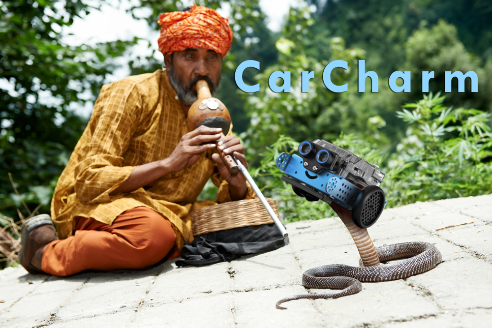

---
# 🧩 Versioning – systém dopĺňa automaticky
fm_version: "1.0.1"

# Dátum buildu – generuje skript
fm_build: "2026-10-03T07:50:26.200245+00:00"

# Poznámka k verzii – voliteľné
fm_version_comment: ""

# 🆔 IDENTITY --------------------------------------------------------

# ID generuje CLI / skript

# Unikátne UUID – generuje skript
guid: "0da9ca53-ca71-4717-b70d-4f4d1aac6b4f"

# 🧭 CONTEXT ---------------------------------------------------------

# DAO / doména (knife, sdlc, q12, 7ds...) dopĺňa skript
dao: "class_sthdf_dashboard"

# Názov zápisu – dopĺňa používateľ
title: "PRJ004"

# Krátky popis – dopĺňa používateľ (voliteľné)
description: "{{DESCRIPTION}}"

# 👥 AUTHORSHIP ------------------------------------------------------

# Hlavný autor – z globálneho configu
author: "Roman Kazicka"

# Zoznam autorov – generuje skript
authors:
  - "Roman Kazicka"

# 🗂 CLASSIFICATION ---------------------------------------------------

# Nadradená kategória – môže doplniť používateľ
category: ""

# Typ dokumentu (guide, case, tutorial...) – používateľ (voliteľné)
type: ""

# Priorita (low/medium/high) – voliteľné
priority: ""

# Tagy – odporúča sa 2–6 tagov.
# Typy tagov:
#   - rámce: knife, 7ds, sdlc, q12
#   - účel: tutorial, guide, pattern, case-study
#   - téma: git, backup, ai, communication
#   - úroveň: beginner, intermediate, advanced
tags: []

# 🌍 LOCALIZATION -----------------------------------------------------

# Jazyk dokumentu – doplní skript podľa štruktúry
locale: "sk"

# 🕒 LIFECYCLE --------------------------------------------------------

# Dátum vytvorenia – generuje skript
created: "2026-10-03 09:50"

# Dátum poslednej úpravy – dopĺňa človek
modified: "2026-10-03 09:50"

# Stav dokumentu – default "backlog"
status: "backlog"

# Viditeľnosť – default "public"
privacy: "public"

# ⚖ INTELLECTUAL PROPERTY -------------------------------------------

# Držiteľ práv k obsahu – dopĺňa skript
rights_holder_content: "Roman Kazicka"

# Systémový vlastník práv
rights_holder_system: "CAA / KNIFE / LetItGrow"

# Licencia
license: "CC-BY-NC-SA-4.0"

# Disclaimer
disclaimer: "Use at your own risk. Methods provided as-is; participation is voluntary and context-aware."

# Copyright
copyright: "© 2025 Roman Kazicka"

# 🔗 ORIGIN / PROVENANCE ---------------------------------------------

# Repozitár pôvodu
origin_repo: ""

# URL pôvodného repozitára
origin_repo_url: ""

# Commit pôvodu
origin_commit: ""

# Branch pôvodu
origin_branch: ""

# Systém pôvodu (CAA/KNIFE/STHDF…)
origin_system: "CAA"

# Pôvodný autor
origin_author: "Roman Kazicka"

# Importovaný zdroj
origin_imported_from: ""

# Dátum importu
origin_import_date: ""

# 🧱 RESERVED ---------------------------------------------------------

fm_reserved1: ""
fm_reserved2: ""
---

<!-- class_sthdf_dashboard_INSTANCE_ID: 01-class_sthdf_dashboard_2023-2024 -->

[🏠 Domov](../../index.md) · [⬅️ Nahor](../)
# PRJ004 — Overview

**CarCharm — Learning through play**

*Lucia Rapánová, Alica Urbanová, Sofia Shatokhina*

Have you ever tried learning a musical instrument? The overwhelming number of notes you need to get used to, the repetitive exercises that seem to suck the soul out of you? Have you been lucky to have a nice and understanding music teacher or did you get stuck with someone who does not understand your musical aspirations nor methods? Worry not, because our project will…

- [Prezentácia / Slides](./presentation/slides.md)
