---
# 🧩 Versioning – systém dopĺňa automaticky
fm_version: "1.0.1"

# Dátum buildu – generuje skript
fm_build: "2026-10-03T07:50:26.223454+00:00"

# Poznámka k verzii – voliteľné
fm_version_comment: ""

# 🆔 IDENTITY --------------------------------------------------------

# ID generuje CLI / skript

# Unikátne UUID – generuje skript
guid: "a6d4ea24-a6bd-4d3d-aa78-2fa231e1e335"

# 🧭 CONTEXT ---------------------------------------------------------

# DAO / doména (knife, sdlc, q12, 7ds...) dopĺňa skript
dao: "class_sthdf_dashboard"

# Názov zápisu – dopĺňa používateľ
title: "slides"

# Krátky popis – dopĺňa používateľ (voliteľné)
description: "{{DESCRIPTION}}"

# 👥 AUTHORSHIP ------------------------------------------------------

# Hlavný autor – z globálneho configu
author: "Roman Kazicka"

# Zoznam autorov – generuje skript
authors:
  - "Roman Kazicka"

# 🗂 CLASSIFICATION ---------------------------------------------------

# Nadradená kategória – môže doplniť používateľ
category: ""

# Typ dokumentu (guide, case, tutorial...) – používateľ (voliteľné)
type: ""

# Priorita (low/medium/high) – voliteľné
priority: ""

# Tagy – odporúča sa 2–6 tagov.
# Typy tagov:
#   - rámce: knife, 7ds, sdlc, q12
#   - účel: tutorial, guide, pattern, case-study
#   - téma: git, backup, ai, communication
#   - úroveň: beginner, intermediate, advanced
tags: []

# 🌍 LOCALIZATION -----------------------------------------------------

# Jazyk dokumentu – doplní skript podľa štruktúry
locale: "sk"

# 🕒 LIFECYCLE --------------------------------------------------------

# Dátum vytvorenia – generuje skript
created: "2026-10-03 09:50"

# Dátum poslednej úpravy – dopĺňa človek
modified: "2026-10-03 09:50"

# Stav dokumentu – default "backlog"
status: "backlog"

# Viditeľnosť – default "public"
privacy: "public"

# ⚖ INTELLECTUAL PROPERTY -------------------------------------------

# Držiteľ práv k obsahu – dopĺňa skript
rights_holder_content: "Roman Kazicka"

# Systémový vlastník práv
rights_holder_system: "CAA / KNIFE / LetItGrow"

# Licencia
license: "CC-BY-NC-SA-4.0"

# Disclaimer
disclaimer: "Use at your own risk. Methods provided as-is; participation is voluntary and context-aware."

# Copyright
copyright: "© 2025 Roman Kazicka"

# 🔗 ORIGIN / PROVENANCE ---------------------------------------------

# Repozitár pôvodu
origin_repo: ""

# URL pôvodného repozitára
origin_repo_url: ""

# Commit pôvodu
origin_commit: ""

# Branch pôvodu
origin_branch: ""

# Systém pôvodu (CAA/KNIFE/STHDF…)
origin_system: "CAA"

# Pôvodný autor
origin_author: "Roman Kazicka"

# Importovaný zdroj
origin_imported_from: ""

# Dátum importu
origin_import_date: ""

# 🧱 RESERVED ---------------------------------------------------------

fm_reserved1: ""
fm_reserved2: ""
---

<!-- class_sthdf_dashboard_INSTANCE_ID: 01-class_sthdf_dashboard_2023-2024 -->

[🏠 Domov](../../../index.md) · [⬅️ Nahor](../)
# PRJ009 — Presentation

Author: Patrik Heglas

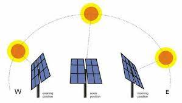

## Motivation

IoT (Internet of Things) domain is getting bigger day by day and it brings many obstacles to overcome. One of which is energy consumption. IoT devices often need external source of power which can be quickly depleted if a device is not operating efficiently. In our case, this can be achieved by optimized recharging. E.g. IoT sensors may be placed in hard to reach places. If we want to avoid changing battery too often, we may incorporate solution to recharge battery. One of which is solar recharging.

Motivation for this project was my diploma thesis which also aims for efficient IoT solution. The goal of this project is to provide solution for efficient power management.

* solar farms: land optimization, eco friendliness, cost efficiency, charge efficiency

* regular user: low maintenance, increase charge efficiency

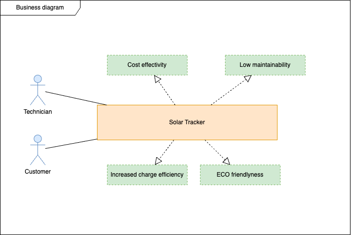

## Overall goal

> Create simple solution to enhance solar recharging capabilities.

## Value proposition

* energy efficiency

* cost saving

* sustainability

## Resources

solar panels, sun position tracking system, energy storage management*, data analytics tools*, positional system

## Stakeholders

utility companies, solar farms, government authorities, research teams

## Basic procedure

During the final stages of business analysis a basic solar tracking procedure was established. Separate steps are represented in the list below:

1. Customer buys the system.

2. Customer starts the tracker.

3. Customer sets-up tracker (geolocation) by provided interface.

4. Customer connects battery to charge (or other appliance)

## System components

This part represents all system components used to build final product. It consist of two servos providing two-axis rotation capabilities and controller handling movements and user interactions. Solution also provides web interface to configure the position of tracker.

 

ESP32 WROOM - microcontroller responsible for calculations and servo handling. It is also capable of running web server which is used as user interface.

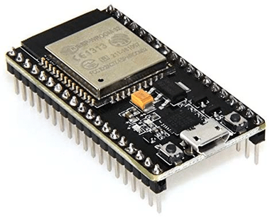

Servo - system consist of two servos providing two-axis rotation capability. The first servo rotates whole platform in 360 degrees and the second is connected to the platform, providing 180 deg. tilt.

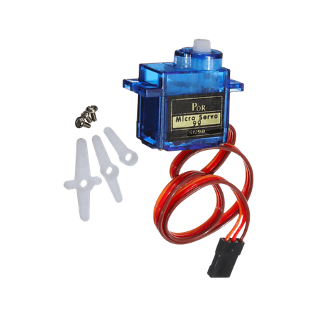

Platform - component is a part of the assembly and holds attached solar panel

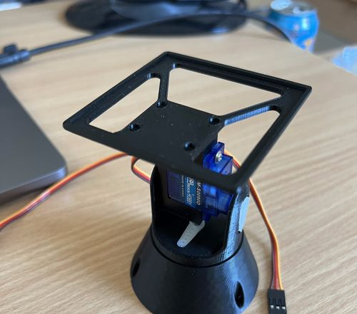

Web interface - web interface component provides easy to use way to setup tracker based on desired geolocation.

Architecture diagram below shows system components. On the left side we can find whole assembly which is rotated by two servos (two-axis). On the right side you can find the core of the tracker. ESP32 controller is responsible for position calculations and provides web interface for user to use.

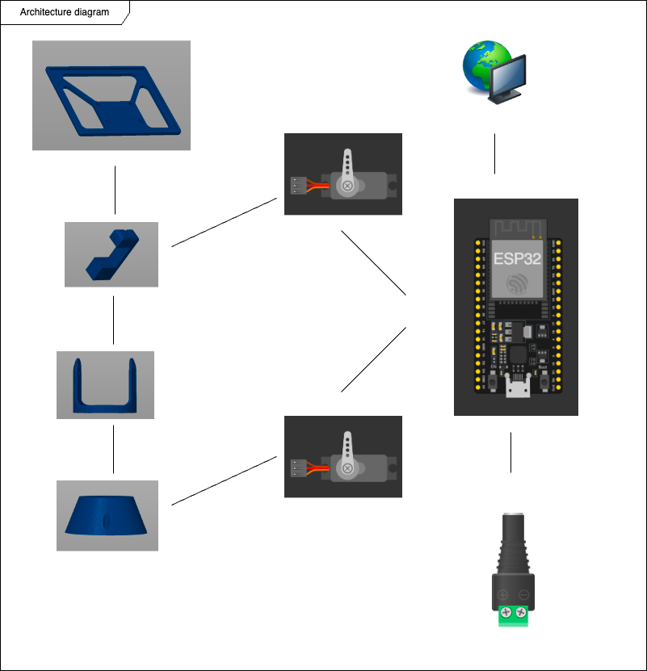

## Design stages

In the first stages we were looking for the most suitable solution. It all started with system sketches.

### Firs system sketch

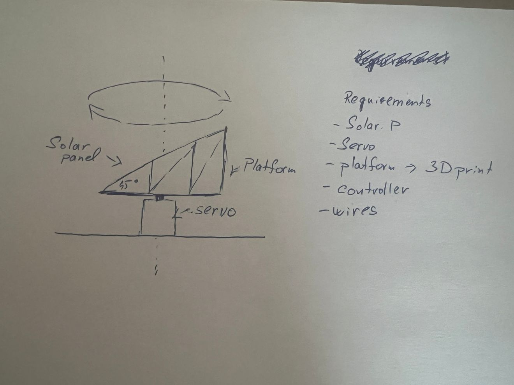

### Web interface wireframe

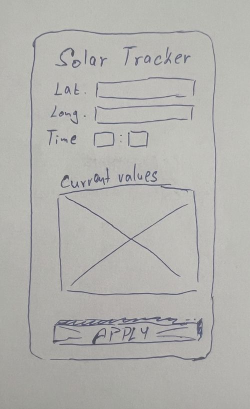

## Assembly with photoresistors

proto2

The second prototype considered only software computation to guide platform rotation. This solution required less components than previous one and was easier and cheaper to implement. As for the structure itself, the model was available online. We just applied small scaling changes to save on material.

The construction consist of the bottom base, top base, arm and platform. Bottom base holds 180 deg. servo that rotates top base according to an azimuth calculated by computational unit. Arm is attached to the top base and provide declination.

## Second and final prototype

## Implementation

There are already many existing open source solutions. In our case we found the most suitable one and changed it a bit to suit our use case. 

Model was imported to Prusa slicer where we can arrange all components to be printed in one run on Prusa i3 MK3S+ printer.

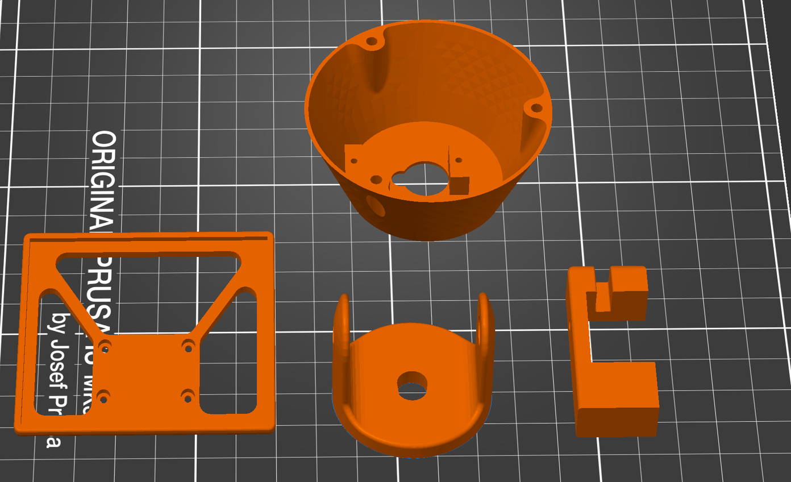

The second part of implementation was to code the logic. We programmed the angle calculations based on formulas. https://www.pveducation.org/pvcdrom/properties-of-sunlight/the-suns-position 

### Web interface

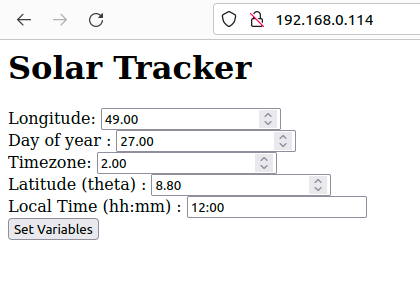

### Angle calculation visualization

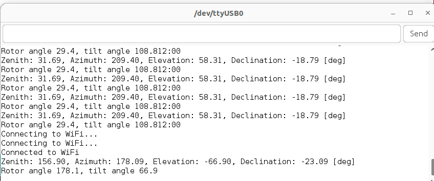

After coding phase we moved to building the system rotational platform.

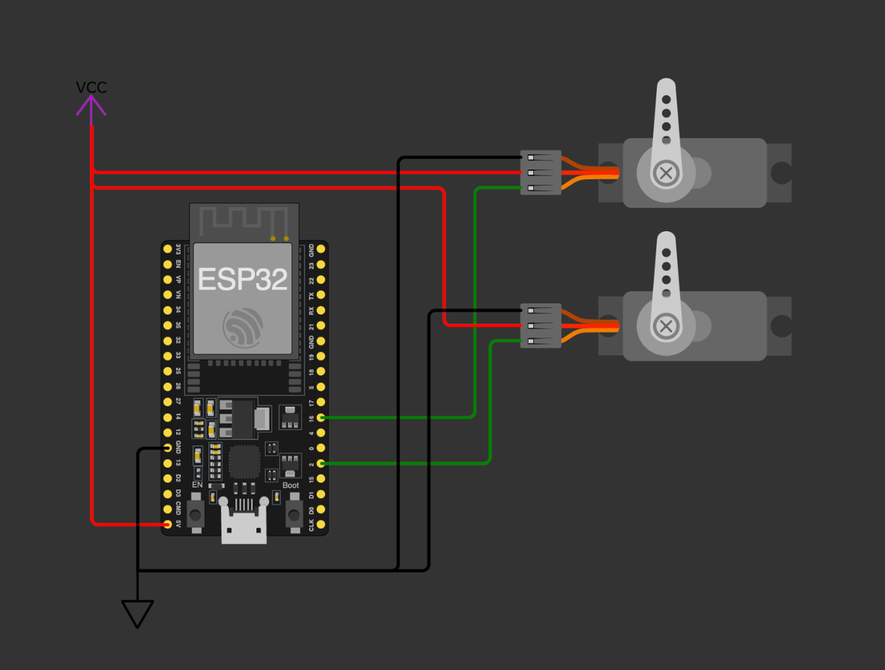

Hardvare wiring schema

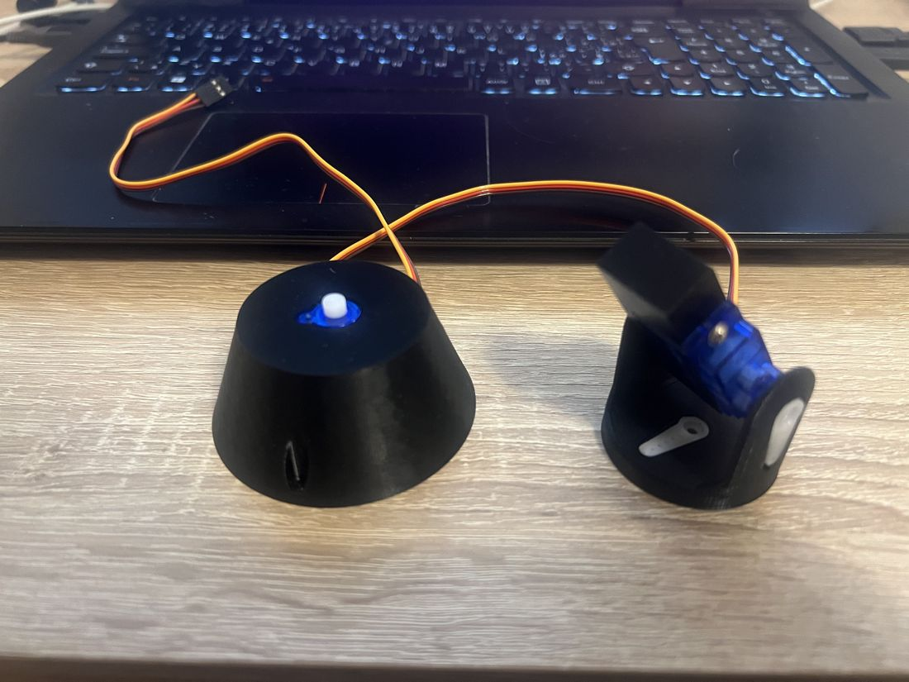

Platform assembly

The diagram below shows used technologies throughout the project. In consist of controller, servos and the rotating platform. 

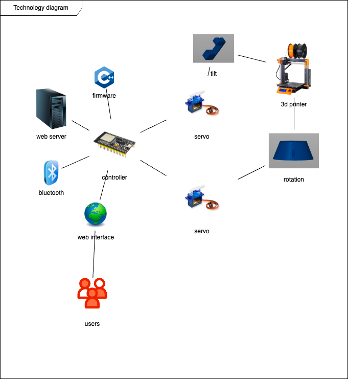

## Used tools

During the work on the project i came across many tools first of which is Prusa slicer. This tool even helped me to edit stencils.

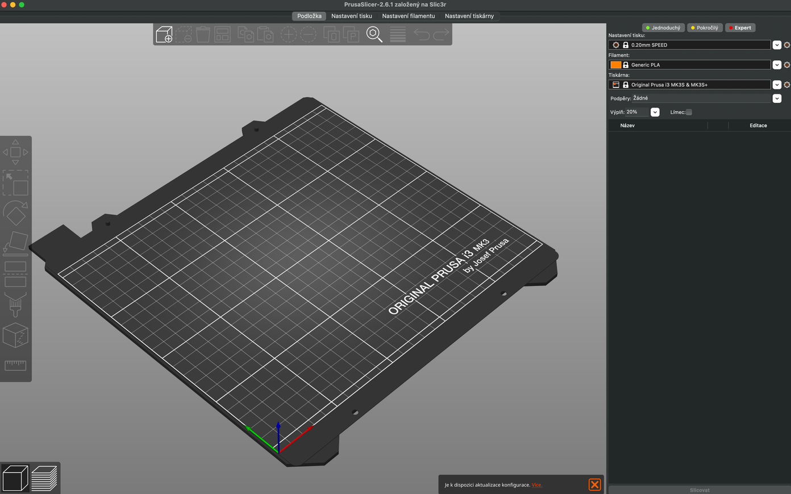

The next set of tools is bitbucket, soruce tree and git. I use git regularly so the command line interface was no news for me.

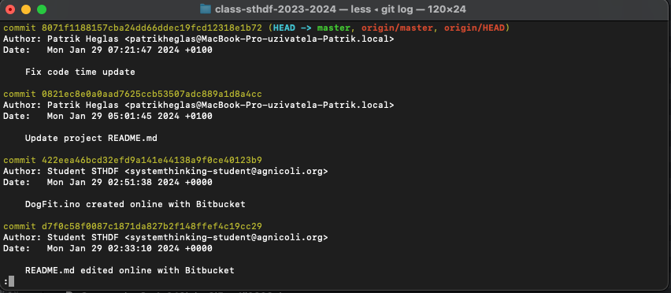

Very helpful graphical tool, even for everyday use, is Drawio.

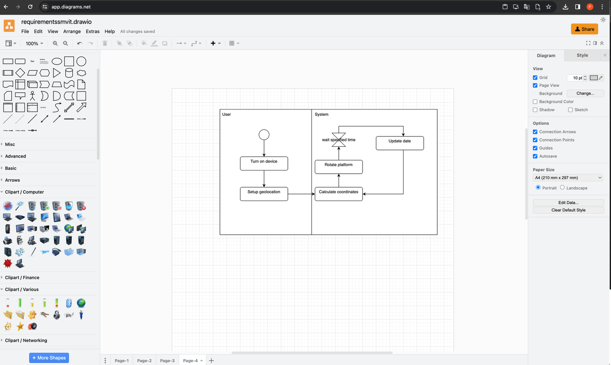

And last but not least, Confluence.  :)

## Lessons learned

* 3D printing

* Bitbucket

* Programming servos

* Sun position calculations  

* many more valuable lessons
