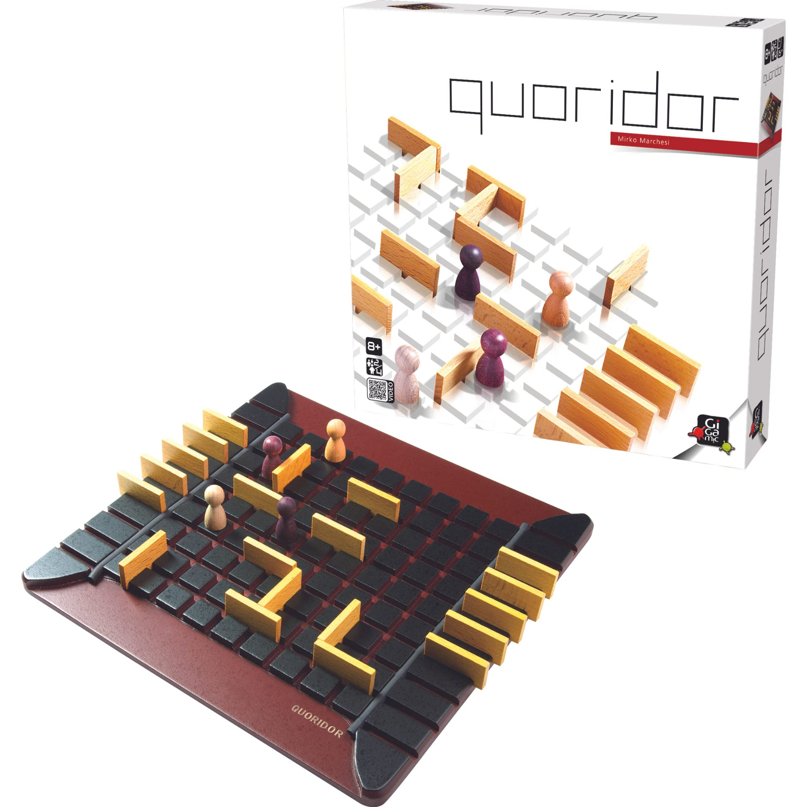
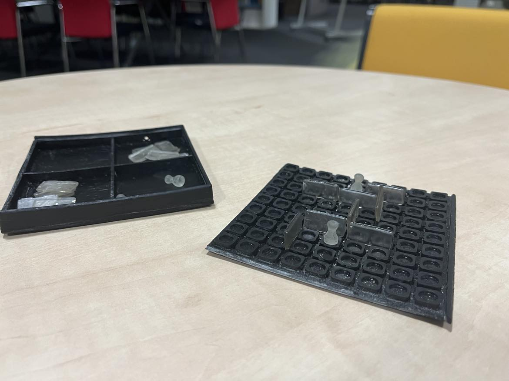

---
# 🧩 Versioning – systém dopĺňa automaticky
fm_version: "1.0.1"

# Dátum buildu – generuje skript
fm_build: "2026-10-03T07:50:26.360969+00:00"

# Poznámka k verzii – voliteľné
fm_version_comment: ""

# 🆔 IDENTITY --------------------------------------------------------

# ID generuje CLI / skript

# Unikátne UUID – generuje skript
guid: "ddb6ce6c-9a33-4e01-b4e3-1bf349d5ff5e"

# 🧭 CONTEXT ---------------------------------------------------------

# DAO / doména (knife, sdlc, q12, 7ds...) dopĺňa skript
dao: "class_sthdf_dashboard"

# Názov zápisu – dopĺňa používateľ
title: "slides"

# Krátky popis – dopĺňa používateľ (voliteľné)
description: "{{DESCRIPTION}}"

# 👥 AUTHORSHIP ------------------------------------------------------

# Hlavný autor – z globálneho configu
author: "Roman Kazicka"

# Zoznam autorov – generuje skript
authors:
  - "Roman Kazicka"

# 🗂 CLASSIFICATION ---------------------------------------------------

# Nadradená kategória – môže doplniť používateľ
category: ""

# Typ dokumentu (guide, case, tutorial...) – používateľ (voliteľné)
type: ""

# Priorita (low/medium/high) – voliteľné
priority: ""

# Tagy – odporúča sa 2–6 tagov.
# Typy tagov:
#   - rámce: knife, 7ds, sdlc, q12
#   - účel: tutorial, guide, pattern, case-study
#   - téma: git, backup, ai, communication
#   - úroveň: beginner, intermediate, advanced
tags: []

# 🌍 LOCALIZATION -----------------------------------------------------

# Jazyk dokumentu – doplní skript podľa štruktúry
locale: "sk"

# 🕒 LIFECYCLE --------------------------------------------------------

# Dátum vytvorenia – generuje skript
created: "2026-10-03 09:50"

# Dátum poslednej úpravy – dopĺňa človek
modified: "2026-10-03 09:50"

# Stav dokumentu – default "backlog"
status: "backlog"

# Viditeľnosť – default "public"
privacy: "public"

# ⚖ INTELLECTUAL PROPERTY -------------------------------------------

# Držiteľ práv k obsahu – dopĺňa skript
rights_holder_content: "Roman Kazicka"

# Systémový vlastník práv
rights_holder_system: "CAA / KNIFE / LetItGrow"

# Licencia
license: "CC-BY-NC-SA-4.0"

# Disclaimer
disclaimer: "Use at your own risk. Methods provided as-is; participation is voluntary and context-aware."

# Copyright
copyright: "© 2025 Roman Kazicka"

# 🔗 ORIGIN / PROVENANCE ---------------------------------------------

# Repozitár pôvodu
origin_repo: ""

# URL pôvodného repozitára
origin_repo_url: ""

# Commit pôvodu
origin_commit: ""

# Branch pôvodu
origin_branch: ""

# Systém pôvodu (CAA/KNIFE/STHDF…)
origin_system: "CAA"

# Pôvodný autor
origin_author: "Roman Kazicka"

# Importovaný zdroj
origin_imported_from: ""

# Dátum importu
origin_import_date: ""

# 🧱 RESERVED ---------------------------------------------------------

fm_reserved1: ""
fm_reserved2: ""
---

<!-- class_sthdf_dashboard_INSTANCE_ID: 01-class_sthdf_dashboard_2023-2024 -->

[🏠 Domov](../../../index.md) · [⬅️ Nahor](../)
# PRJ035 — Presentation

## Portable Board Game - Quoridor

## Authors - Leonard Puškáč, Ema Richnáková

This project involves the redesign of a relatively popular board game called Quoridor. The game itself is about finding the shortest path to the other end of the board, while making the path of the opponent longer.

The original rendition of the game has a classic board game format - a board with some game pieces - all in a cardboard box.

## The aim of our project is to:
1. Redesign the form of the game such that it is more portable
2. Learn to use a resin based 3D print

## The Project Structure

Information about the authors of this project can be found in About Us

Our Knowledge Contribution documents can be found in Knowledge Contribution

All the figures used in our documents can be found in Figures

And finally the main parts of our project can be found in the Project folder. Inside it, there are 5 documents describing the project, as well as the Models folder containing the model of the game.

## The Original Game

## Our Result

